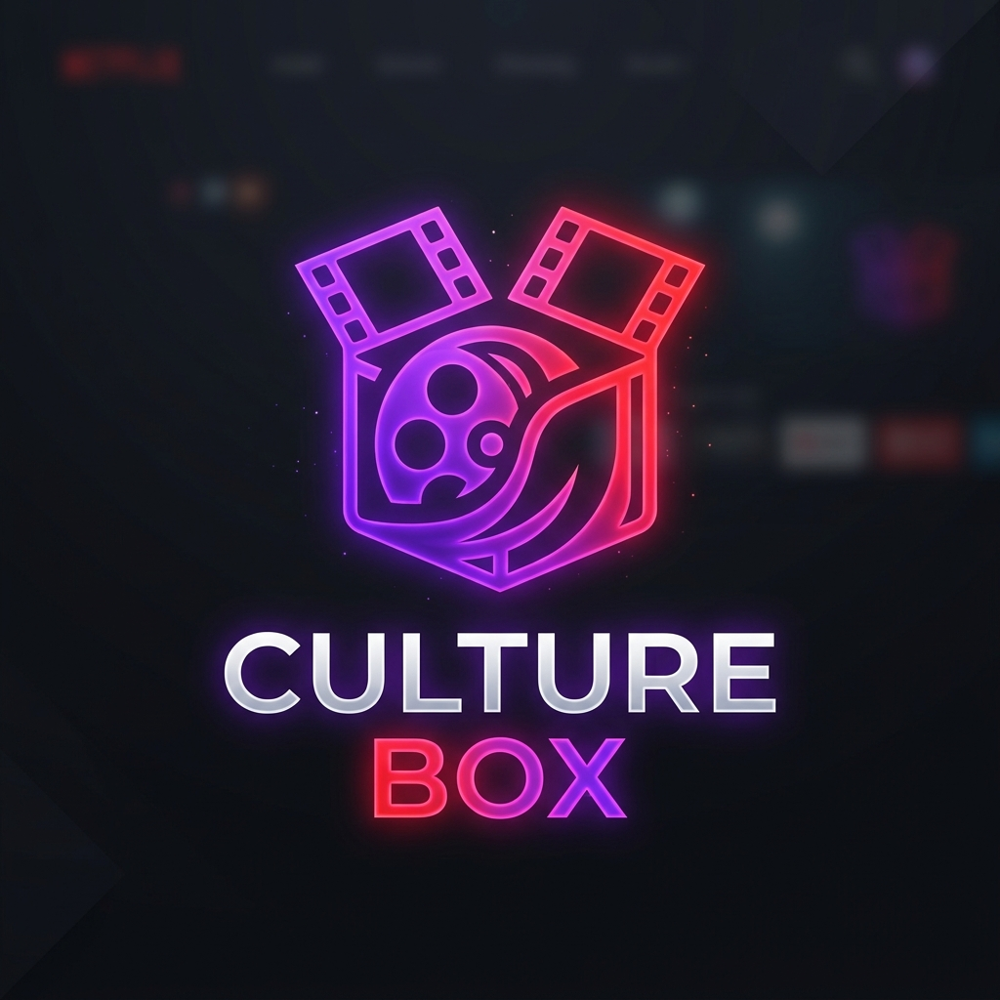

<p align="center">
  
</p>

# Culture Box - OTT Streaming Platform Backend

**Culture Box** is a modern Over-The-Top (OTT) streaming platform backend engineered to deliver digital cinema experiences—ranging from feature-length blockbuster movies to independent short films, documentaries, and web series.

The platform provides a high-performance RESTful API powering content discovery, media management, user authentication, catalog searching, and seamless video hosting integration.

---

## Architectural Principles and Best Practices

This project strictly adheres to modern software architecture standards and production best practices:

### 1. Clean Architecture & Layered Separation of Concerns
The application codebase is organized into distinct, decoupled layers:
- **API Router Layer (`app/api/v1/`)**: Handles request routing, parameters extraction, HTTP response status codes, and API documentation tags.
- **Service Layer (`app/services/`)**: Contains all business logic, permission checks, database transaction orchestration, and caching strategies.
- **Repository Layer (`app/repositories/`)**: Abstracted database access layer isolating SQLAlchemy query logic from domain business rules.
- **Schema Layer (`app/schemas/`)**: Strong type definitions and validation rules using Pydantic v2.
- **Core Infrastructure Layer (`app/core/`)**: Configuration settings, security modules, dependencies, database clients, and external storage abstractions.

### 2. Async-First Python Performance
- Built on top of FastAPI and Uvicorn.
- Database access utilizes **SQLAlchemy 2.0 Async Engine** with `asyncpg` driver for non-blocking I/O operations.
- External API calls and storage requests use `httpx` async clients.

### 3. Provider-Agnostic Storage Architecture & Memory-Optimized Streaming
- **Abstract Storage Provider Interface**: Storage logic is completely decoupled behind the `StorageProvider` base interface (`app/core/storage/base.py`). This enables seamless integration with any video hosting or storage provider—including **Cloudflare Stream**, **Vimeo**, **AWS S3**, **Google Cloud Storage**, or custom CDNs—without altering core business services.
- **Zero-Buffer Streaming**: File uploads stream file objects (`SpooledTemporaryFile`) directly to the target storage destination without loading entire binary files into system RAM (`file.read()`), preventing Out-Of-Memory (OOM) failures under heavy media uploads.

### 4. Enterprise Security Standards
- **Strong Password Hashing**: Utilizes **Argon2** (`argon2-cffi`), the state-of-the-art password hashing algorithm.
- **JWT Authentication**: OAuth2 Bearer token implementation using signed JSON Web Tokens (`PyJWT`).
- **Role-Based Access Control (RBAC)**: Endpoint security dependencies for verifying active user status and superuser privileges.

### 5. High-Performance Caching & Search
- **Redis Integration**: Configured with Upstash Redis (`app/core/cache.py`) for low-latency endpoint caching.
- **Typesense Search Engine**: Integrated fuzzy search engine (`app/core/search.py`) for rapid multi-attribute search across movies, short films, genres, and cast members.

### 6. Modern Tooling & Dependency Management
- **Package Management**: Powered by **uv** for ultra-fast, reproducible python environment installations.
- **Schema Migrations**: Database schema updates managed asynchronously via **Alembic**.

---

## Directory Structure

```text
culture_box/
├── app/
│   ├── api/
│   │   └── v1/            # API endpoints (Auth, Movies, Users, Search, Genres, People)
│   ├── core/              # Core configs, security, dependencies, storage drivers
│   │   └── storage/       # Abstract storage provider interface and implementations
│   ├── models/            # SQLAlchemy database models
│   ├── repositories/      # Data access layer (Repository pattern)
│   ├── schemas/           # Pydantic validation models
│   └── services/          # Business logic services
├── alembic/               # Database migrations
├── scripts/               # Utility and health scripts
├── tests/                 # Integration and unit tests
├── Dockerfile             # Multi-stage container definition
├── pyproject.toml         # Dependencies and project metadata
├── main.py                # FastAPI entry point & lifespan handler
└── logo.png               # Culture Box platform logo
```

---

## Tech Stack

- **Framework**: FastAPI
- **Database**: PostgreSQL with `asyncpg` and SQLAlchemy 2.0
- **Database Migrations**: Alembic
- **Storage Provider**: Abstracted (`StorageProvider` interface supports Cloudflare Stream, Vimeo, S3, or any custom video host)
- **Caching**: Upstash Redis
- **Search Engine**: Typesense
- **Authentication**: JWT & Argon2
- **Package Manager**: `uv`

---

## Getting Started

### Prerequisites

- Python 3.14+
- `uv` package manager (`curl -LsSf https://astral.sh/uv/install.sh | sh`)
- PostgreSQL database
- Video hosting / storage provider account (Cloudflare Stream, Vimeo, S3, etc.)

### Setup Instructions

1. **Clone the repository**:
   ```bash
   git clone <repository-url>
   cd culture_box
   ```

2. **Set up virtual environment & install dependencies**:
   ```bash
   uv sync
   source .venv/bin/activate
   ```

3. **Configure Environment Variables**:
   Create a `.env` file in the root directory matching your configuration:
   ```env
   PROJECT_NAME="culture_box"
   API_V1_STR="/api/v1"

   # SECURITY
   SECRET_KEY="your-production-secret-key"
   ALGORITHM="HS256"
   ACCESS_TOKEN_EXPIRE_MINUTES=30
   REFRESH_TOKEN_EXPIRE_DAYS=7

   # DATABASE
   POSTGRES_USER="your-db-user"
   POSTGRES_PASSWORD="your-db-password"
   POSTGRES_SERVER="your-db-host"
   POSTGRES_PORT="5432"
   POSTGRES_DB="your-db-name"

   # REDIS
   UPSTASH_REDIS_REST_URL="https://your-redis-instance.upstash.io"
   UPSTASH_REDIS_REST_TOKEN="your-redis-token"

   # TYPESENSE
   TYPESENSE_API_KEY="your-typesense-api-key"
   TYPESENSE_HOST="your-typesense-host"
   TYPESENSE_PORT="443"
   TYPESENSE_PROTOCOL="https"
   ```

4. **Run Database Migrations**:
   ```bash
   uv run alembic upgrade head
   ```

5. **Start the Development Server**:
   ```bash
   uv run uvicorn main:app --reload --port 8000
   ```
   Interactive API documentation will be available at:
   - Swagger UI: `http://localhost:8000/docs`
   - ReDoc: `http://localhost:8000/redoc`

---

## Running Tests

Execute test suite using `pytest`:

```bash
uv run pytest
```

---

## License

This project is proprietary and confidential.
